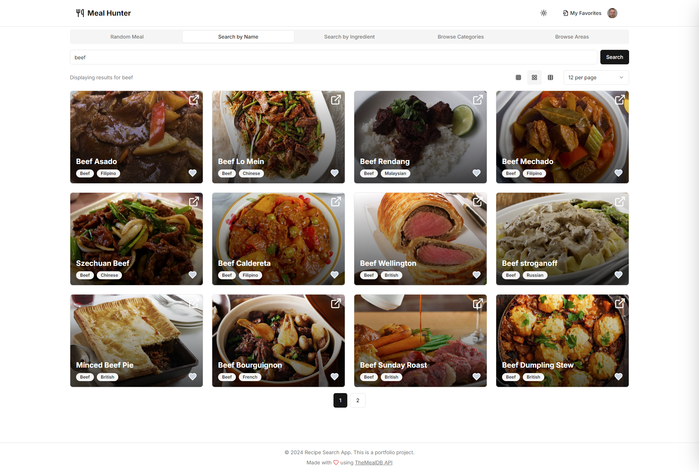

# Meal Hunter

A Next.js application for searching and discovering delicious meals.

## Features

- Search for meals by name, ingredient, category, or area.
- Browse random meals.
- View detailed meal information, including instructions and video tutorials.
- Add meals to your favorites.
- Responsive design for various screen sizes.

## Technologies Used

- Next.js
- Tailwind CSS
- React
- TheMealDB API
- Clerk.js (for authentication)
- Firebase (for favorites)

## Getting Started

1. Clone the repository: `git clone https://github.com/your-username/meal-hunter-3.git`
2. Install dependencies: `npm install`
3. Run the development server: `npm run dev`

## Screenshots

```markdown

_Home Page_


_Search Results By Name as Cards_


_Search Results By Name as Table_


_Search Results by Area_


_Favorites_


_Meal Details_
```

## License

MIT License
